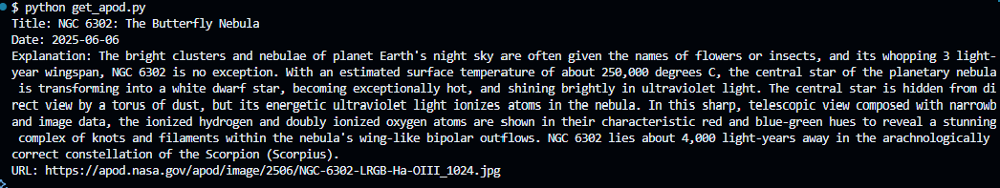

# NASA APOD AI Agent

## Overview
This Python project integrates NASA's Astronomy Picture of the Day (APOD) API with an AI agent to retrieve and analyze stunning space images and their descriptions.

## Features
- Fetch APOD data from NASA's API
- Display image title, date, explanation, and URL
- AI agent for additional insights or improvements

## Prerequisites
Ensure you have Python installed (recommended: Python 3.8+). You'll also need an API key from NASA's [APOD API](https://api.nasa.gov).

## Setting Up Virtual Environment (if VS Code doesn't auto-configure)

If your VS Code doesn't automatically activate the virtual environment, follow these steps:

**Create the virtual environment**
## On Windows
- venv\Scripts\activate
- pip install -r requirements.txt
- python get_apod.py

